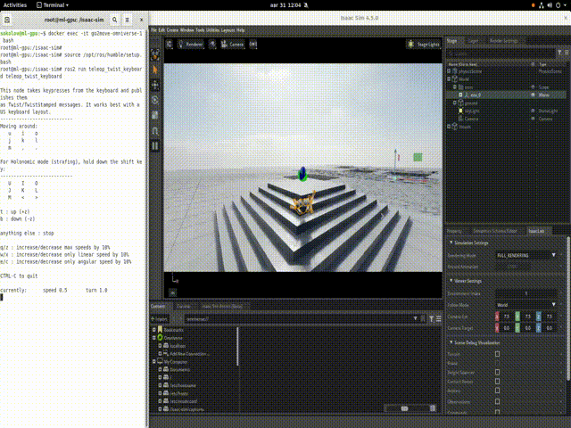

# GO2MOVE
[](https://docs.omniverse.nvidia.com/isaacsim/latest/overview.html)
[](https://isaac-sim.github.io/IsaacLab)


## О проекте
   Библиотека для управление роботом Unitree Go2

## Задачи
   - [x] Создать воспроизводимую Docker-среду с IsaacLab
   - [x] Реализовать симуляцию робособаки
   - [x] Разработать неблокирующий GUI-джойстик для - управления
   - [x] Организовать многопоточную архитектуру
   - [x] Обеспечить взаимодействие через env.step()

## Запуск окружения
   Запуск контейнера выполнить с помощью [devcontainer](https://code.visualstudio.com/docs/devcontainers/containers)
   
   Либо вручную с помощью  docker compose
   ```bash
   docker compose -f ./docker-compose.yaml -f ./.devcontainer/docker-compose.yml build

   docker compose -f ./docker-compose.yaml -f ./.devcontainer/docker-compose.yml up -d

   docker exec -it go2move-omniverse-1 bash
   ```
## Запуск скрипта
   Код для запуска управления через carb и omni.ui
   ```bash
   source /opt/ros/humble/setup.bash
   ./isaaclab.sh -p ./go2move/go2move/main.py
   ```
   Если требуется управление через teleop_twist_keyboard, нужно первоначально запустить скрипт 
   ```bash
   source /opt/ros/humble/setup.bash
   ros2 run teleop_twist_keyboard teleop_twist_keyboard
   ```

## Пример работы
### Клавиатура

### GUI

### Teleop_twist_keyboard


## TODO
   - [x] Чтение команд из teleop_twist_keyboard для ROS2
   - [x] Переделать интерфейс для carb, GUI под единый формат ввода teleop_twist_keyboard
   - [x] Отрефакторить код
   - [x] Создать отдльный файл конфигурации джойстика
   - [x] Создать README
   - [x] Записать демо видео
   - [ ] Создать Docs
   - [ ] Переписать модуль согласно [IsaacLabExtensionTemplate](https://github.com/isaac-sim/IsaacLabExtensionTemplate)